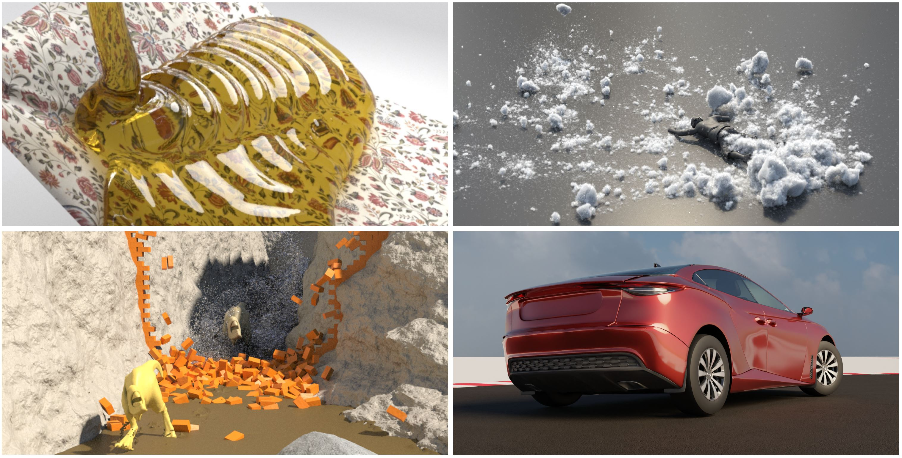

 

## Authors

* [Daniel Holz](https://ca.linkedin.com/in/daniel-holz-51104a32), École de technologie supérieure, Canada
* [Stefan Rhys Jeske](https://srjeske.de/), RWTH Aachen University, Germany
* [Fabian Löschner](https://floeschner.de/), RWTH Aachen University, Germany
* [Jan Bender](https://www.animation.rwth-aachen.de), RWTH Aachen University, Germany
* [Yin Yang](https://yangzzzy.github.io/), University of Utah, USA 
* [Sheldon Andrews](https://profs.etsmtl.ca/sandrews/), École de technologie supérieure, Canada

---

## Eurographics State-of-the-Art Report 2025 

### Paper

* [Multiphysics Simulation Methods in Computer Graphics](https://animation.rwth-aachen.de/media/papers/93/2025-CGF-STAR-Multiphysics.pdf)

### Slides

* [Introduction & Constraint-Based Multiphysics Modeling](slides/01_intro_constraint_based.pdf)
* [Energy-Based Multiphysics Modeling](slides/02_energy_based.pdf)
* [Point-Based Multiphysics Modeling](slides/03_point_based.pdf)

---

## Multiphysics Simulation Code

SPlisHSPlasH is an open-source particle-based multiphysics simulation framework. You can download the code here:

* [SPlisHSPlasH](https://splishsplash.physics-simulation.org/)

A constraint-based open-source framework for the simulation of rigid bodies, deformable solids and fluids can be downloaded here: 

* [PositionBasedDynamics](https://github.com/InteractiveComputerGraphics/PositionBasedDynamics)
