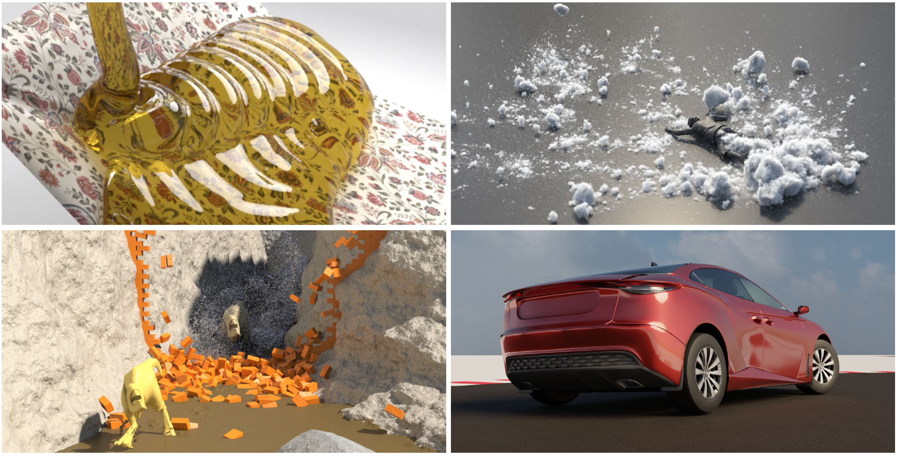

 

---

## Eurographics Tutorial 2026

### Authors

* [Fabian Löschner](https://floeschner.de/), RWTH Aachen University, Germany
* [Stefan Rhys Jeske](https://srjeske.de/), RWTH Aachen University, Germany
* [José Antonio Fernández-Fernández](https://animation.rwth-aachen.de/person/48/), RWTH Aachen University, Germany
* [Jan Bender](https://www.animation.rwth-aachen.de), RWTH Aachen University, Germany
https://animation.rwth-aachen.de/person/48/
 
### Paper

* [Simulation Methods for Multiphysics Phenomena in Visual Computing](https://animation.rwth-aachen.de/media/papers/100/2026-EG-Multiphysics_Tutorial.pdf)

---
 

## Eurographics State-of-the-Art Report 2025 

### Authors

* [Daniel Holz](https://ca.linkedin.com/in/daniel-holz-51104a32), Unity Technologies & École de technologie supérieure, Canada
* [Stefan Rhys Jeske](https://srjeske.de/), RWTH Aachen University, Germany
* [Fabian Löschner](https://floeschner.de/), RWTH Aachen University, Germany
* [Jan Bender](https://www.animation.rwth-aachen.de), RWTH Aachen University, Germany
* [Yin Yang](https://yangzzzy.github.io/), University of Utah, USA 
* [Sheldon Andrews](https://profs.etsmtl.ca/sandrews/), École de technologie supérieure, Canada

### Paper

* [Multiphysics Simulation Methods in Computer Graphics](https://animation.rwth-aachen.de/media/papers/93/2025-CGF-STAR-Multiphysics.pdf)

### Slides

* [Introduction & Constraint-Based Multiphysics Modeling](slides/01_intro_constraint_based.pdf)
* [Energy-Based Multiphysics Modeling](slides/02_energy_based.pdf)
* [Point-Based Multiphysics Modeling](slides/03_point_based.pdf)

---
 

## Multiphysics Simulation Code

SPlisHSPlasH is an open-source particle-based multiphysics simulation framework: 

* [SPlisHSPlasH](https://splishsplash.physics-simulation.org/)

A constraint-based open-source framework for the simulation of rigid bodies, deformable solids and fluids: 

* [PositionBasedDynamics](https://github.com/InteractiveComputerGraphics/PositionBasedDynamics)

A C++ library for symbolic differentiation with automatic code generation, compilation and evaluation:

* [SymX](https://github.com/InteractiveComputerGraphics/SymX)

A C++ and Python simulation platform that provides easy access to state-of-the-art methods to robustly solve simulations of rigid and deformable objects in a strongly coupled manner:

* [STARK](https://github.com/InteractiveComputerGraphics/stark)

An introduction to state-of-the-art simulation methods for rigid bodies, deformable solids and fluids in the area of visual computing:

* [Physics Simulation](https://interactivecomputergraphics.github.io/physics-simulation/)